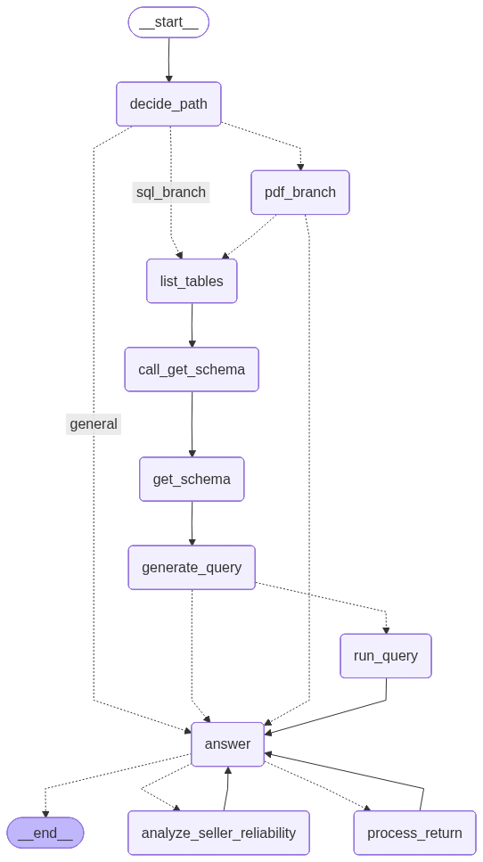

# AI Analyst Chat Agent

A LangGraph-based chat agent that intelligently routes queries to retrieve information from PDFs and query databases for data analysis, return requests, and seller reliability analysis.

## Features

- **Intelligent Routing**: Automatically routes queries to PDF, SQL, both, seller analysis, return processing, or general conversation
- **PDF Retrieval**: Extracts return policy information from PDF documents
- **Database Integration**: Queries customer orders, payment information, and seller metrics
- **Return Processing**: Updates order status to 'return_processed' in the database
- **Seller Reliability Analysis**: Analyzes seller performance based on late delivery rates and review scores
- **Conversation Memory**: Maintains chat history using LangGraph checkpointing

## Architecture

- **Backend**: FastAPI with LangChain/LangGraph agent
- **Frontend**: React chat interface
- **Database**: SQLite (`datasets/olist_ecommerce.db`)
- **LLM**: OpenAI GPT-5
- **Documents**: PDF policy retrieval (`docs/BIX-return-policy.pdf`)

## Agent Workflow

The agent uses intelligent routing to determine the best path for each query:



1. **Route Decision** (`decide_path`): LLM analyzes query and selects one of 6 paths:
   - `sql_branch`: Database queries only
   - `pdf_branch`: Policy information only
   - `pdf_sql_branch`: Both PDF and database needed
   - `process_return`: Direct return processing
   - `analyze_seller_reliability`: Seller reliability analysis
   - `general`: General conversation

2. **Execution**: Agent follows the selected path, gathering necessary information from PDF, database, or both

3. **Answer Generation**: Combines all context to generate a comprehensive response

## Setup

### Prerequisites

- Python 3.11+
- Node.js 16+
- OpenAI API key
- DBeaver Community (optional, for database inspection)

### Environment Setup

1. Copy the example environment file:
```bash
# Linux/Mac
cp .env.example .env

# Windows
copy .env.example .env
```

2. Edit `.env` and configure your API keys:
```env
# Required
OPENAI_API_KEY=your_openai_api_key_here

# Optional: LangSmith tracing for monitoring and debugging
LANGCHAIN_API_KEY=your_langsmith_api_key_here
LANGCHAIN_TRACING_V2=true
LANGCHAIN_PROJECT=return-agent
```

**Note**: Get your LangSmith API key from [smith.langchain.com](https://smith.langchain.com/). Tracing is optional but recommended for debugging and monitoring agent behavior.

### Database Setup

1. Navigate to the datasets directory:
```bash
cd datasets
```

2. Run the database creation script:
```bash
python create_database.py
```

This will create `olist_ecommerce.db` from the CSV files in the directory.

**Note**: The script requires `pandas`, which is included in `requirements.txt`.

### Accessing the Database with DBeaver Community

1. **Install DBeaver Community**: Download from [dbeaver.io](https://dbeaver.io/download/)

2. **Create a new SQLite connection**:
   - Open DBeaver
   - Click "New Database Connection" (plug icon)
   - Select "SQLite"
   - Click "Next"

3. **Configure the connection**:
   - **Path**: Browse to `datasets/olist_ecommerce.db` in your project directory
     - Example: `C:\path\to\langchain-AI-summit\datasets\olist_ecommerce.db`
   - Click "Test Connection" to verify
   - Click "Finish"

4. **Explore the database**:
   - Expand the connection to see all tables
   - Right-click any table → "View Data" to browse records
   - Use the SQL Editor to run custom queries

**Example queries in DBeaver**:
```sql
-- View all orders
SELECT * FROM orders LIMIT 10;

-- Check order statuses
SELECT order_status, COUNT(*) as count 
FROM orders 
GROUP BY order_status;

-- Find orders eligible for return (delivered within 30 days)
SELECT order_id, order_status, 
       date(order_delivered_customer_date) as delivered_date,
       date('now') - date(order_delivered_customer_date) as days_since_delivery
FROM orders 
WHERE order_status = 'delivered' 
  AND date('now') - date(order_delivered_customer_date) <= 30;
```

### Backend

```bash
pip install -r requirements.txt
python main.py
```

Backend runs at `http://localhost:8000`

### Frontend

```bash
cd frontend
npm install
npm run dev
```

Frontend runs at `http://localhost:3000`

## Usage

The agent routes queries based on intent:
- Policy questions → PDF branch
- Order/data queries → SQL branch
- Eligibility checks → PDF + SQL branch
- Return requests → process_return
- Seller analysis → analyze_seller_reliability
- General questions → general conversation

### Example Queries

**Policy Questions:**
- "Qual é o prazo máximo para devolução?"
- "Como funciona a política de devolução?"

**Order Information:**
- "Qual é o status do pedido 6514b8ad8028c9f2cc2374ded245783f?"
- "Qual o id do cliente para o pedido X?"

**Eligibility Checks:**
- "O pedido e481f51cbdc54678b7cc49136f2d6af7 é elegível para devolução?"
- "O pedido X pode ser devolvido?"

**Return Processing:**
- "Devolver o pedido e481f51cbdc54678b7cc49136f2d6af7"
- "Processar devolução do pedido 12345"

**Seller Reliability:**
- "O seller 3442f8959a84dea7ee197c632cb2df15 é confiável?"
- "Quais os top 3 vendedores menos confiáveis?"

## API Endpoints

- `POST /chat`: Send messages to the chat agent
  - Request: `{"message": "user query", "thread_id": "optional"}`
  - Response: `{"message": "agent response", "status": "success"}`
- `GET /health`: Health check
- `GET /`: API information

## Testing

```bash
pytest tests/
```

## Development

Main agent code: `agent/return_agent.py`
- Uses LangGraph for workflow orchestration
- Routes queries through 6 possible paths based on LLM decision
- Maintains conversation state with checkpointing
